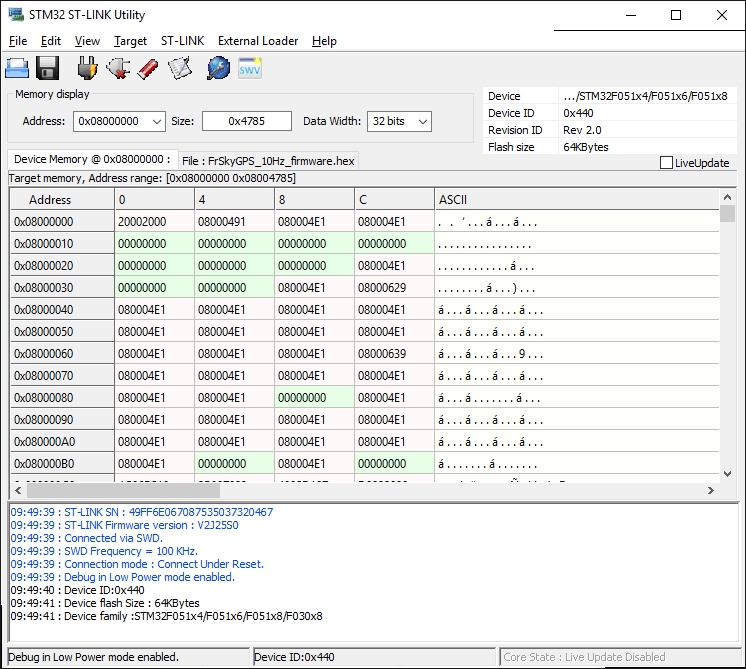

# Connect the discovery board

I selected the STM32F0Discovery board because it was inexpensive and used the same chip family as found on the FrSkyGPS board.  Any ST-Link compatible hardware will allow you to upgrade the firmware on your GPS.

Once you have the board, the next step is to download and install ST-Link from http://www.st.com/web/en/catalog/tools/PF258168.

You need a fully wired mini USB cable.  A cell phone cable with the right connector (USB mini Type B) will work if it was made for synchronization. Charge only cables will not work.

Keep in mind that some of the underside pins of the discovery board are 'hot'.  I place mine on a piece of foam.

Now run ST-Link and make sure you can connect to the Discovery board. Select 'Target', 'Connect'.  It should look something like this:

Next we will connect the FrSkyGPS to the discovery board.