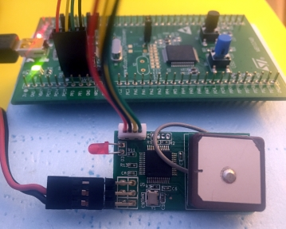
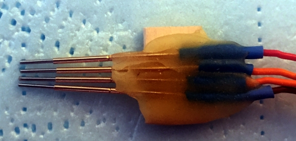

# Connect the FrSkyGPS sensor


Uploading new firmware to the GPS sensor requires only a four wire connection to the discovery board.

Use caution when cutting the heat sink off of the sensor.  You'll also find a small piece of cardboard on the GPS side.  Set it aside, and we'll use it again when we are done.

#### *** Note: ***

To use the discovery board as an ST-Link you must ***remove both jumpers at CN3***.  I simply place them on the outside pins so I don't lose them.

Below I have soldered the 1.25mm connectors to the GPS sensor and used a servo type 4-wire connector to SWD pins on the Discovery board.  ***The wire colors and order may be different on your connectors, so make sure you have the connections correct.***



Considering the top left of the GPS sensor as pin 1, the mapping is as follows.
```
GPS Pin  signal (color shown)   Discovery Pin
   1 -----  VDD   (red)    ------- 1
   2 -----  SWDIO (black)  ------- 4
   3 -----  SWCLK (yellow) ------- 2
   4 -----  GND   (green)  ------- 3
```

If you prefer not to solder under a magnifying glass, then the Pogo Pins are an easy solution.  My jig was made from scrap wood, hot glue, and a little epoxy to hold the pins. 


Here is a close up shot of the pins (note that I have snipped off the tips).  They are spring loaded and require very little pressure to make a good connection.



I don't think the connection order is important, but I always power the GPS sensor first, then plug in the discovery board.

The next step is to use ST-Link to load the new firmware.


