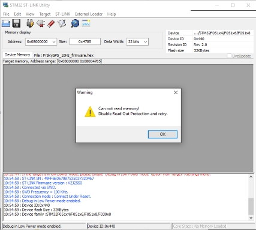
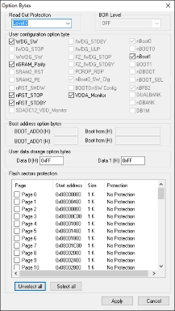
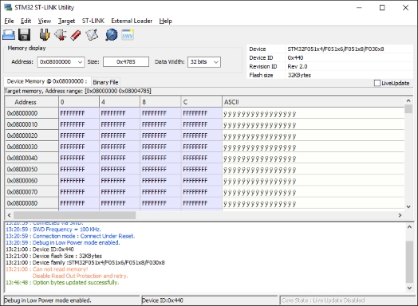
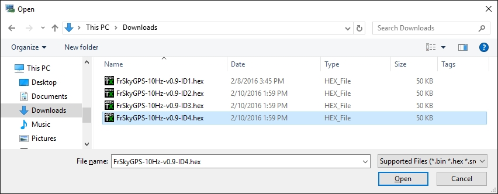
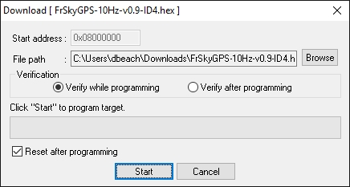

# Load new firmware with ST-Link

#### To review, have you:

1. Tested the discovery board stand alone?
2. Removed the jumpers from CN2?
3. Wired the GPS sensor correctly?
4. Supplied power to the GPS sensor?
5. Connected the discovery board to your PC?

#### Good, now for the exciting part!

Start ST-Link and use the menu "Target", "Connect". If all is well, you'll get a dialog box that says "Can not read memory.  Disable Read Out Protection and retry". Don't panic, this is not a problem.



Press 'OK'. Now back to the menu selecting 'Target', 'Option Bytes...'. At the top left change 'Read Out Protection' to 'Level 0' using the drop down as shown. Once you press 'Apply' here the ***FrSky supplied firmware will be erased, and there is no going back.***



Erasing the firmware takes a few seconds, and then you are back at the main screen.



Now load the new firmware (downloaded from http://dsbeach.github.io/FrSkyGPS_10Hz_firmware/) onto the sensor.  Use the menu 'Target', 'Program & Verify...' and select the version of the firmware with the sensor ID you will use.  This ID must not be shared by any other sensors connected to your FrSky receiver.  It can only be changed by reloading a different file.



Select a file and press 'Open'.



Press 'Start' and if all is well you'll see 
```
14:19:05 : Memory programmed in 19s and 234ms.
14:19:05 : Verification...OK
```

Congratulations! Firmware update is done. Grab some heat shrink, and dont' forget to put the cardboard over the GPS chip before you shrink it down.

#### Now get the GPS sensor back in your aircraft and go fly!