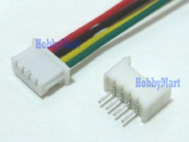

# What you will need

## Hardware:

<table>
<tr>
<td>

FrSky GPS V2 sensor

</td>
<td>

ST-Link device (STM32F0Discovery shown)

</td>
<td>

1.25mm JST type connector

</td>
<td>

Servo connectors

</td>
</tr>
</table>
 
If you would rather not solder to your GPS sensor I've had good success using 'Pogo Pins'.  However, to get the required 1.25mm spacing  you'll need to snip the tips off.

<table>
<tr>
<td>

My test stand

</td>
<td>

Pogo Pin closeup

</td>
</table>

The components above are generally available world-wide, but here are the suppliers I've used and can recommend:

* Aloft Hobbies - for all things FrSky related https://alofthobbies.com/
* Mouser Electronics - for the STM32F0Discovery board http://www.mouser.com/
* SparkFun Electronics - USB cables, Pogo Pin, and other interesting stuff https://www.sparkfun.com/
* Hansen Hobbies - Servo connectors and wires http://www.hansenhobbies.com/
* Alibaba - 1.25mm 4-wire Jst type connectors http://www.alibaba.com

## Software

* FrSkyGPS 10Hz firmware from http://dsbeach.github.io/FrSkyGPS_10Hz_firmware/
* ST-Link utility for Windows from http://www.st.com/web/en/catalog/tools/PF258168

This guide covers the firmware update process using a Microsoft Windows based PC.  Linux users should refer to http://www.hertaville.com/stm32f0discovery-part-1-linux.html for more information regarding using the Discovery board on that platform.

